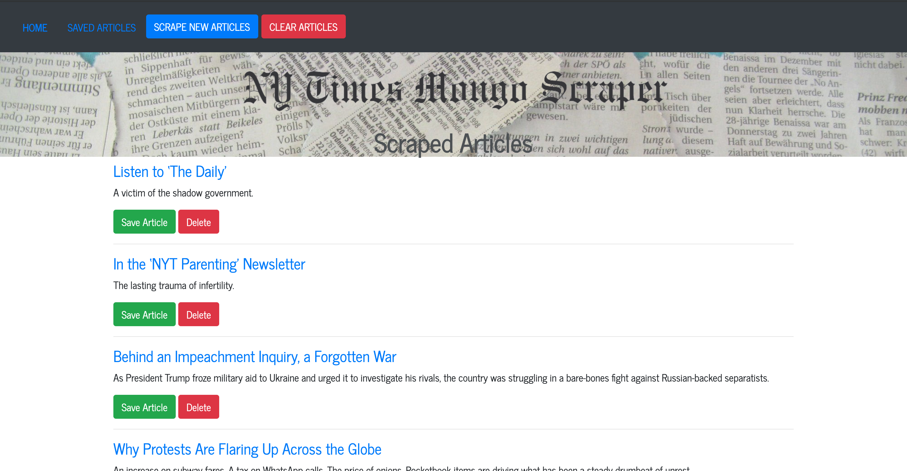

# New York Times Article Scraper

## Overview
An app that scrapes articles from the New York Times website and lets users save articles and leave comments on the latest news.

## How It Works
- Scrape new articles by clicking the "Scrape Articles" button.
- Once the artilces are loaded, you can click on the title to take you to the full News reading page; also, you can save or delete each article.
- Go to the "Saved Articles" page by clicking on the top menu.
- In each saved article, you can save a note by clicking the "View/Add Notes" button and also you can see the previous notes per article if there any. Also, after saving a note, it can be deleted by pressing the "X" button at the end of the note.
- Clicking the "Delete" button, either in the Home page or the Saved Articles page will delete each article.
- On the top menu, there is a Clear Articles button, which will delete all the articles and its notes either saved or scraped articles.

[Check out the App](https://caromongo-scraper.herokuapp.com/)

## Technologies Used
- Node.js
- Express.js
- Handlebars.js
- MongoDB
- Mongoose
- npm packages
    - express
    - express-handlebars
    - mongoose
    - cheerio
    - axios

### Author: Caro Berry